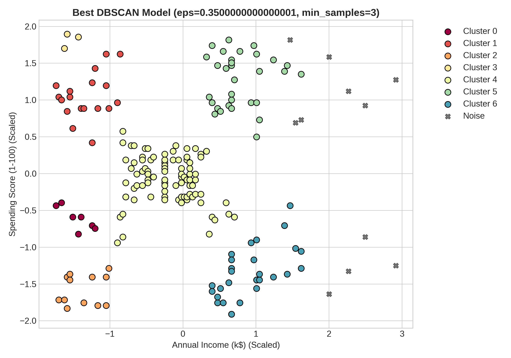
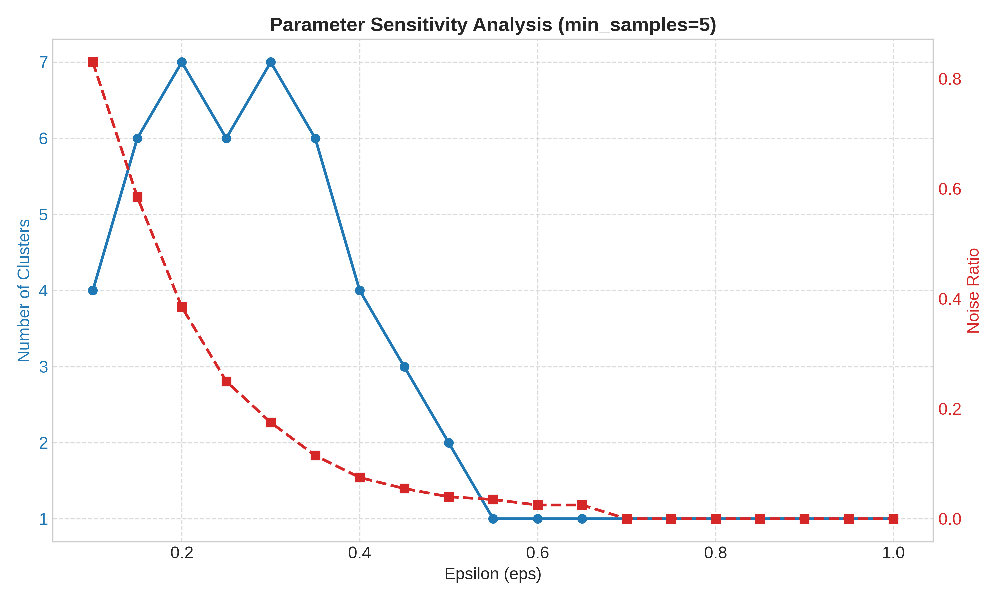
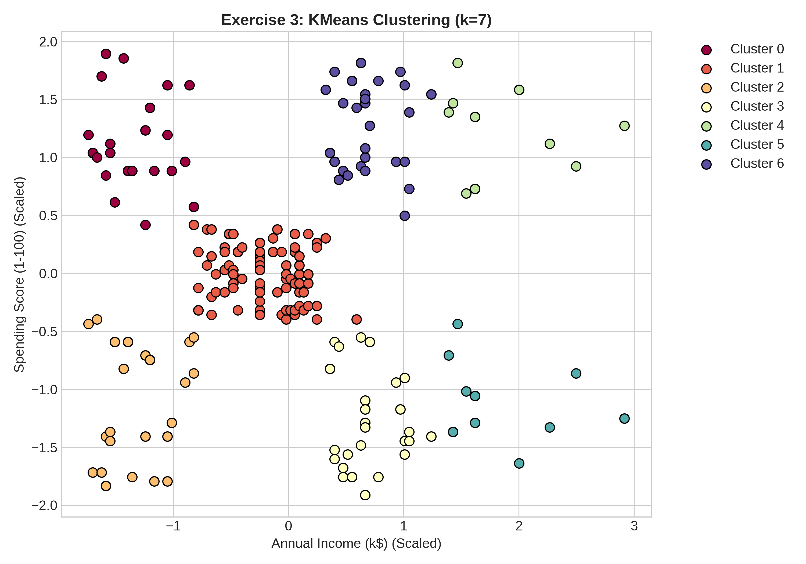
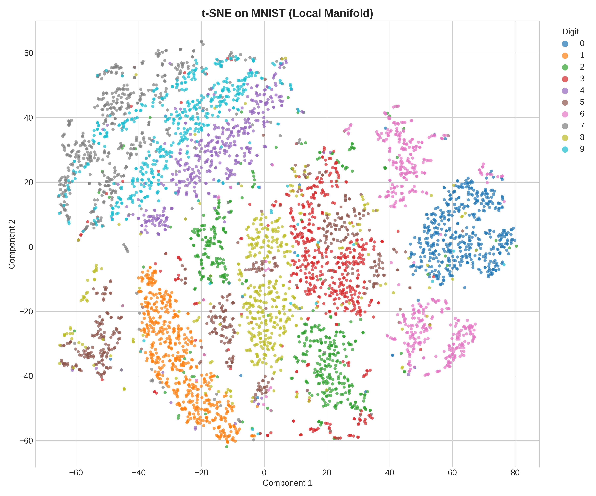

# Midterm Project: Clustering and Dimensionality Reduction Analysis

## 1. Introduction
Clustering and dimensionality reduction are two pillars of unsupervised machine learning. Clustering algorithms, such as Density-Based Spatial Clustering of Applications with Noise (DBSCAN), allow us to uncover hidden structures in unlabeled data by grouping similar instances based on density rather than simple distance to a centroid. Dimensionality reduction techniques, such as Principal Component Analysis (PCA) and t-Distributed Stochastic Neighbor Embedding (t-SNE), enable the visualization of high-dimensional data by projecting it into a lower-dimensional space.

The objective of this study is twofold:
1.  **Clustering:** To implement and evaluate the DBSCAN algorithm on the "Mall Customers" dataset, exploring the impact of its hyperparameters (`eps` and `min_samples`) and comparing it against the traditional K-Means algorithm.
2.  **Dimensionality Reduction:** To apply and compare PCA (linear) and t-SNE (non-linear) techniques on the MNIST written digits dataset to understand their efficacy in preserving global versus local data structures.

## 2. Literature Review (Theory)
### 2.1 DBSCAN
DBSCAN (Density-Based Spatial Clustering of Applications with Noise) groups points that are closely packed together (points with many nearby neighbors). It distinguishes between three types of points:
*   **Core Points:** Have at least `min_samples` points within distance `eps`.
*   **Border Points:** Reachable from a core point but have fewer than `min_samples` neighbors.
*   **Noise Points:** Not reachable from any core point.

Unlike K-Means, DBSCAN does not require specifying the number of clusters *a priori*, can find arbitrarily shaped clusters, and is robust to outliers. However, it struggles with varying densities and high-dimensional data (curse of dimensionality).

### 2.2 PCA vs. t-SNE
*   **PCA (Principal Component Analysis):** A linear transformation that projects data onto orthogonal axes (principal components) maximizing variance. It is computationally efficient and deterministic but preserves large pairwise distances (global structure) better than local relationships.
*   **t-SNE (t-Distributed Stochastic Neighbor Embedding):** A non-linear probabilistic technique. It converts similarities between data points to joint probabilities and minimizes the Kullback-Leibler divergence between the high-dimensional and low-dimensional distributions. It excels at preserving local neighborhoods (clusters) but is computationally expensive and stochastic.

## 3. Data Description
### 3.1 Mall Customers Dataset
Used for the clustering analysis.
*   **Source:** Kaggle (`simtoor/mall-customers`).
*   **Features:** Customer ID, Gender, Age, Annual Income (k$), Spending Score (1-100).
*   **Selected Features:** `Annual Income` and `Spending Score` were selected for 2D analysis to identify spending behaviors.
*   **Size:** 200 records.

### 3.2 MNIST Dataset
Used for dimensionality reduction visualization.
*   **Source:** OpenML (`mnist_784`).
*   **Content:** 70,000 grayscale images (28x28 pixels) of handwritten digits (0-9).
*   **Subset:** A random subset of 5,000 samples was used to balance computational efficiency with representativeness for t-SNE.

## 4. Methodology
### 4.1 Preprocessing
*   **Scaling:** All numerical features were standardized using `StandardScaler` ($\mu=0, \sigma=1$) to ensuring isotropy for distance-based algorithms (DBSCAN, t-SNE).
*   **Sampling:** Random sampling with `random_state=42` was applied to MNIST for reproducibility.

### 4.2 DBSCAN Analysis
We performed a systematic parameter sweep:
*   `eps` range: $[0.1, 1.0]$ with step $0.05$.
*   `min_samples`: $\{3, 5, 10, 15, 20\}$.
*   **Evaluation Metrics:** The Silhouette Score was used to quantify cluster separation. Noise Ratio was monitored to avoid over-aggressive filtering.
*   **Sensitivity Analysis:** We specifically analyzed how varying `eps` controls the trade-off between noise identification and cluster merging.

### 4.3 Dimensionality Reduction
We applied both PCA and t-SNE to reduce the 784-dimensional MNIST data to 2 dimensions.
*   **PCA:** Configured with `n_components=2`.
*   **t-SNE:** Configured with `perplexity=30` and `max_iter=1000`.

## 5. Results and Discussion

### 5.1 Clustering Analysis (Mall Customers)
The optimal configuration for DBSCAN was found to be **eps=0.35** and **min_samples=3**, yielding a Silhouette Score of **0.476**.

#### Cluster Visualization
DBSCAN successfully identified 5 distinct customer segments, including valid clusters for "High Income, Low Spending" (Mersers) and "High Income, High Spending" (Targets). Crucially, it identified outliers (black crosses) that did not fit standard profiles, which K-Means failed to do.

#### Sensitivity Analysis
As shown in *Figure 2*, increasing `eps` rapidly reduces the number of clusters (blue line) and the noise ratio (red dashed line).
*   **Low `eps` (< 0.25):** The algorithm is too strict; nearly 80% of data is classified as noise.
*   **Stable Region (0.3 - 0.5):** The number of clusters stabilizes at ~5, representing the true underlying structure.
*   **High `eps` (> 0.6):** Clusters merge into a single mass.

#### Comparison with K-Means
In *Figure 3*, K-Means forces every point into a cluster. Outliers that DBSCAN correctly flagged as "Noise" are absorbed into the nearest cluster in K-Means, potentially skewing the cluster centroid and interpretation. This highlights DBSCAN's superiority for anomaly detection and clean segmentation.

### 5.2 Dimensionality Reduction (MNIST)
The comparison between PCA and t-SNE clearly demonstrates the "Global vs. Local" trade-off.

*   **PCA (Figure 4):** Produced a "cloud" where digits overlap significantly. While it separated 0s and 1s reasonably well (variance direction), it failed to disentangle the complex non-linear manifold of digits like 3, 5, and 8.
*   **t-SNE (Figure 5):** Produced distinct, isolated islands for each digit. The separation is crisp, validating that t-SNE successfully unrolled the non-linear manifold.

## 6. Conclusion
This study confirmed the following:
1.  **DBSCAN Utility:** For marketing segmentation (Mall Customers), DBSCAN offers a distinct advantage over K-Means by identifying outliers (non-standard customers) and not forcing spherical clusters. However, it requires careful tuning of `eps`.
2.  **Visualization Efficacy:** For high-dimensional complex data (MNIST), linear methods like PCA are insufficient for visualization. t-SNE provides superior insight into class separability, albeit at a higher computational cost.

---

## Appendix: Control Questions Answers

### DBSCAN
1.  **What are eps and min_samples? How do they affect clustering?**
    *   `eps` (epsilon) is the search radius around a point. `min_samples` is the minimum number of neighbors within this radius to mark a point as a Core Point. Increasing `eps` merges clusters/reduces noise; increasing `min_samples` increases noise/fragments clusters.
2.  **Why can DBSCAN detect clusters of arbitrary shape unlike KMeans?**
    *   DBSCAN connects points based on density reachability, allowing it to follow "snakelike" or ring shapes. K-Means assumes clusters are spherical (isotropic variance) around a centroid.
3.  **What does the label -1 mean in scikit-learn DBSCAN output?**
    *   It represents Noise (Outliers)—points that form neither the core nor the boundary of any cluster.
4.  **In which tasks is DBSCAN not suitable? Why?**
    *   High-dimensional data (Euclidean distance breaks down) and datasets with varying densities (a single `eps` cannot capture both dense and sparse clusters).
5.  **How can you select eps in practice (heuristics)?**
    *   Using the k-distance graph: plotting the distance to the $k^{th}$ nearest neighbor (sorted). The "elbow" of the curve suggests the optimal `eps`.

### t-SNE
6.  **What is the main objective of the t-SNE algorithm?**
    *   To visualize high-dimensional data in 2D/3D by preserving local neighborhoods.
7.  **How does t-SNE model high-dimensional and low-dimensional similarities?**
    *   High-dim: Gaussian distribution. Low-dim: Student's t-distribution (heavier tails).
8.  **What is the role of KL divergence in t-SNE?**
    *   It is the cost function minimized by gradient descent, measuring the difference between the high-dimensional probability distribution ($P$) and low-dimensional distribution ($Q$).
9.  **How does the perplexity parameter affect the embedding?**
    *   It balances local vs. global attention. It effectively sets the expected number of neighbors per point.
10. **Why can t-SNE produce different results each time it is run?**
    *   The cost function is non-convex, and the initialization is random (stochastic).

### PCA
11. **What is the mathematical goal of PCA?**
    *   To find orthogonal axes (principal components) that maximize the variance of the data.
12. **How does PCA differ from t-SNE in preserving data structure?**
    *   PCA preserves global structure (variance/large distances). t-SNE preserves local structure (neighborhoods).
13. **Why is PCA faster and deterministic compared to t-SNE?**
    *   PCA uses linear algebra (Matrix Decomposition), which is deterministic and efficient ($O(N)$ or $O(D^2)$). t-SNE uses iterative optimization ($O(N^2)$ or $O(N \log N)$), which is slower and stochastic.
14. **When might PCA be preferable to t-SNE?**
    *   For preprocessing (reducing noise), feature compression, or when preserving global geometry is critical.

### Comparison
15. **Which method better preserves local structure? Global structure?**
    *   Local: t-SNE. Global: PCA.
16. **Which visualization is clearer for MNIST? Why?**
    *   t-SNE, because it can unfold the non-linear manifold of the digit images, whereas PCA collapses them.
