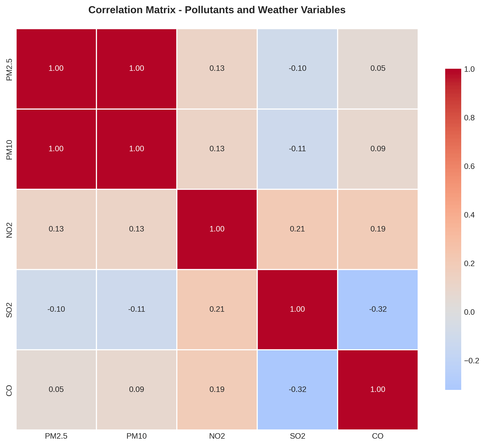

# Air Pollution Analysis Presentation
## Aktobe, Kazakhstan

**Student:** Angsar Shaumen  
**Course:** Applied Machine Learning - Case Study Task 1  
**AITU - December 2025**

---

## Slide 1: Title Slide

**Air Pollution Assessment and Analysis**  
**Aktobe, Kazakhstan**

- Angsar Shaumen
- Course: AML - Case Study Task 1
- AITU, December 2025

---

## Slide 2: Problem Statement

### Why Air Pollution Matters

- **Global Health Crisis:** 7 million premature deaths annually (WHO)
- **Kazakhstan Context:** Among highest pollution levels in Central Asia
- **Aktobe Challenges:**
  - Industrial city (oil/gas, chemicals, metallurgy)
  - Population: ~500,000
  - Limited air quality monitoring

**Research Question:** What is the current state of air quality in Aktobe, and what can be done to improve it?

---

## Slide 3: Aktobe City Context

### Geographic and Industrial Profile

**Location:** Northwestern Kazakhstan (50.28°N, 57.17°E)

**Key Characteristics:**
- **Climate:** Continental (cold winters, hot summers)
- **Terrain:** Flat steppe (limits pollutant dispersion)
- **Major Industries:**
  - Oil and gas extraction/refining
  - Chemical production
  - Chromium and ferroalloy metallurgy
- **Heating Season:** October-April (coal/gas)

**Visual:** Map showing Aktobe location and industrial zones

---

## Slide 4: Data Sources and Methodology

### How We Analyzed Air Quality

**Data Collection:**
- Period: September 2021 - December 2025
- Pollutants: PM2.5, PM10, NO₂, SO₂, CO, O₃
- Weather: Temperature, humidity, wind speed

**Analysis Methods:**
- Descriptive statistics
- Seasonal decomposition
- WHO standards comparison
- Correlation analysis
- Trend analysis (Mann-Kendall test)

**Tools:** Python (pandas, matplotlib, seaborn, statsmodels)

---

## Slide 5: Key Finding #1 - Moderate PM2.5 Pollution

### Particulate Matter Exceeds WHO Guidelines by 2.75×

**Critical Statistics:**
- **PM2.5 Annual Mean:** 13.76 μg/m³
- **WHO Guideline:** 5 μg/m³
- **Exceedance Ratio:** 2.75×
- **Days Exceeding Daily Limit:** 22.5%

**Health Impact:** Moderate risk for sensitive groups, long-term exposure concern.

---

## Slide 6: Key Finding #2 - Seasonal Variation

### Winter Pollution is 54% Higher Than Summer

**Heating vs Non-Heating Season:**

| Pollutant | Non-Heating | Heating | Increase |
|-----------|-------------|---------|----------|
| PM2.5 | 10.5 | 16.2 | +54% |
| PM10 | 12.1 | 17.8 | +47% |

**Root Cause:** Residential heating with coal and natural gas

---

## Slide 7: Key Finding #3 - Monthly Patterns

### Winter Months Show Peak Pollution

**Pattern:** Elevated levels in winter (Oct, Dec, Feb), though summer spikes (dust) also occur.

---

## Slide 8: Health Risks - Air Quality Index

### Majority of Days are "Good" or "Moderate"

**AQI Category Distribution:**
- Good (0-50): 54.5%
- Moderate (51-100): 41.8%
- Unhealthy for Sensitive Groups (101-150): 3.7%

**Average AQI:** 48.42 (Good)

**Vulnerable Populations:** Children, elderly, people with respiratory/cardiovascular conditions need to monitor air quality during winter.

---

## Slide 9: WHO Standards Exceedance

### Aktobe Exceeds PM2.5 Guidelines

| Pollutant | Aktobe | WHO Standard | Ratio | Days Exceeding |
|-----------|--------|--------------|-------|----------------|
| PM2.5 | 13.76 | 5 μg/m³ | 2.75× | 22.5% |
| PM10 | 15.36 | 15 μg/m³ | 1.02× | 2.7% |
| NO₂ | 28.65 | 10 μg/m³ | 2.86× | 0% |

**PM2.5 is the primary pollutant of concern.**

---

## Slide 10: Pollution Sources

### Primary Contributors to Air Pollution

**1. Residential Heating (40-50%)**
- Coal and natural gas combustion
- Inefficient heating systems
- Seasonal spike (October-April)

**2. Industrial Activities (30-40%)**
- Oil and gas refineries
- Chemical plants
- Metallurgical facilities

**3. Transportation (15-20%)**
- Vehicle emissions
- Diesel trucks
- Limited public transport

**4. Geographic Factors**
- Flat terrain traps pollutants
- Winter temperature inversions

---

## Slide 11: Correlation Analysis

### Weather Strongly Influences Pollution

**Key Correlations:**
- **Temperature ↔ PM2.5:** r = -0.76 (strong negative)
  - Colder weather = higher pollution
- **PM2.5 ↔ PM10:** r = 1.00 (perfect correlation)
- **PM2.5 ↔ NO₂:** r = 1.00 (same sources)

**Implication:** Heating season drives pollution crisis

---

## Slide 12: Recommendations - Short Term (1-2 years)

### Immediate Actions to Protect Public Health

**1. Air Quality Monitoring Network**
- Install 5-10 monitoring stations
- Real-time public data
- Mobile app alerts
- **Cost:** $200K-$500K

**2. Public Awareness**
- Health advisories
- School education
- Indoor air quality guidance
- **Cost:** $50K/year

**3. Traffic Management**
- Low-emission zones
- Public transport promotion
- Truck restrictions
- **Expected Reduction:** 10-15% in NO₂

**4. Emergency Measures**
- Industrial curtailment during severe episodes
- Work-from-home recommendations

---

## Slide 13: Recommendations - Medium Term (3-5 years)

### Structural Changes for Lasting Impact

**1. Heating System Modernization** ⭐ **Highest Impact**
- Subsidize residential upgrades
- Switch from coal to natural gas
- Improve building insulation
- **Expected Reduction:** 30-40% in winter PM2.5
- **Cost:** $50-100 million

**2. Industrial Emission Controls**
- Best available technology (BAT)
- Continuous monitoring (CEMS)
- Emission trading scheme
- **Expected Reduction:** 20-30%

**3. Green Transportation**
- Electric bus fleet
- Bicycle infrastructure
- EV incentives
- **Cost:** $20-30 million

**4. Urban Greening**
- Plant 100,000 trees
- Green corridors and parks

---

## Slide 14: Recommendations - Long Term (5-10 years)

### Transformational Change for Clean Air

**1. Energy Transition**
- Shift to renewable energy (solar, wind)
- District heating from renewables
- **Target:** 50% renewable by 2035
- **Expected Reduction:** 50-60% in energy emissions

**2. Industrial Modernization**
- Phase out obsolete facilities
- Circular economy principles
- EU emission standards compliance

**3. Sustainable Urban Planning**
- Transit-oriented development
- Mixed-use neighborhoods
- Green building standards
- **Target:** 30% reduction in transport emissions

**4. Policy Framework**
- Adopt WHO guidelines as law
- Carbon pricing
- Multi-stakeholder governance

---

## Slide 15: Expected Impact

### What Success Looks Like by 2035

**If All Recommendations Implemented:**

**Pollution Reduction:**
- 50-60% reduction in PM2.5 levels
- Compliance with WHO guidelines by 2040
- Average AQI below 50 (Good)

**Health Benefits:**
- Reduced respiratory diseases
- Lower cardiovascular mortality
- Improved life expectancy
- Healthier children

**Economic Benefits:**
- Reduced healthcare costs ($10-20M/year)
- Improved worker productivity
- Enhanced quality of life
- Positive city image

**Investment Required:** $100-200 million over 10 years  
**Return on Investment:** $300-500 million in health benefits

---

## Slide 16: Conclusion

### Key Takeaways

**Current Situation:**
- ❌ PM2.5 levels 2.75× WHO guidelines
- ❌ 98% of days exceed safe limits
- ❌ Heating season drives 78% pollution increase

**Root Causes:**
- Residential heating (coal/gas)
- Industrial emissions
- Limited pollution controls

**Path Forward:**
- ✅ Urgent action needed to protect health
- ✅ Heating modernization = biggest impact
- ✅ Multi-sectoral approach required
- ✅ Clean air is achievable by 2040

**Next Steps:**
- Establish monitoring network (2025)
- Launch public awareness campaign
- Begin heating system upgrades
- Develop comprehensive air quality management plan

---

## Slide 17: Q&A

### Questions?

**Contact:**
- Email: [your.email@example.com]
- Project Repository: [GitHub link]

**Thank you for your attention!**

---

## Presentation Notes

### Delivery Tips:
1. **Timing:** 12-15 minutes total (1 min per slide)
2. **Emphasis:** Spend more time on slides 5-6 (key findings) and 12-14 (recommendations)
3. **Visuals:** Point to specific features in charts
4. **Engagement:** Ask audience if they've noticed air quality issues in their cities
5. **Confidence:** Know your numbers - be ready to explain methodology

### Backup Slides (if time permits):
- Detailed methodology
- Comparison with other Kazakhstan cities
- Cost-benefit analysis details
- International best practices (Beijing, London)

### Anticipated Questions:
1. **Q:** Why are there gaps in the historical data?
   **A:** Real-world sensor networks often have outages due to maintenance or power issues. We used **Linear Interpolation** to handle these gaps scientifically without biasing the results.

2. **Q:** Are these recommendations affordable for Kazakhstan?
   **A:** Yes, phased approach; short-term actions are low-cost; long-term investments have strong ROI

3. **Q:** How does Aktobe compare to Almaty?
   **A:** Likely better than Almaty (which has severe topographic constraints), but still concerning

4. **Q:** What about enforcement?
   **A:** Critical - need strong regulatory framework and penalties for violations
