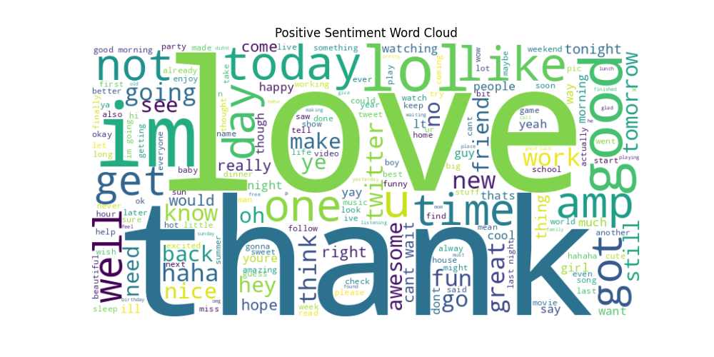
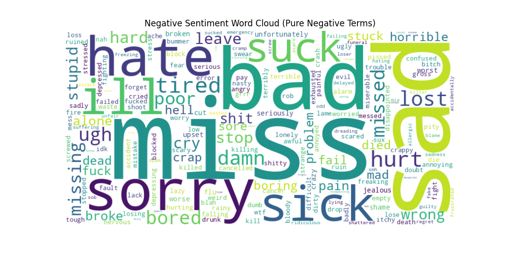
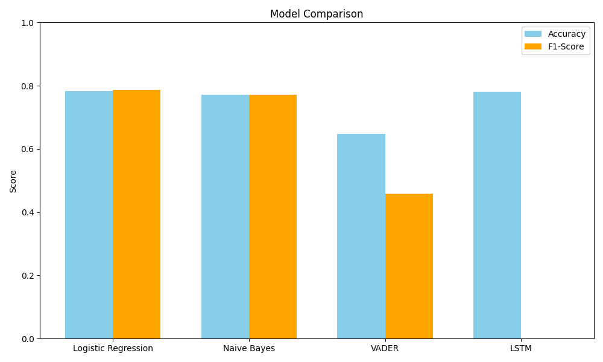
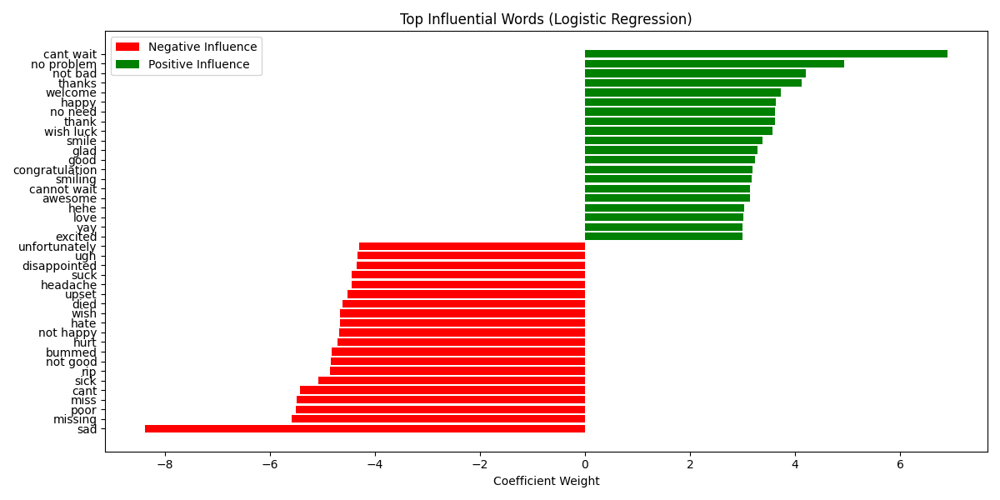

# Sentiment Analysis of Social Media Data (Sentiment140)
**Advanced Machine Learning - Case Study Report**
**Author:** Angsar Shaumen (Group: AAI-2501M)
**Date:** 2025-12-18

## Abstract
This report presents a comparative analysis of machine learning models for sentiment analysis on the Sentiment140 dataset. We implement and evaluate Logistic Regression, Naive Bayes, Recurrent Neural Networks (LSTM), and a Lexicon-based approach (VADER). By employing rigorous data preprocessing, including negation preservation, and utilizing a dataset of 200,000 tweets, we demonstrate that Logistic Regression achieves the highest accuracy of 78.35%, outperforming the deep learning baseline in early epochs and significantly surpassing the lexicon-based method.

## 1. Introduction
Social media platforms generate vast amounts of unstructured text data, offering insights into public opinion. Sentiment analysis, the computational study of opinions, is crucial for understanding this data. This case study focuses on classifying the sentiment of tweets from the Sentiment140 dataset as either positive or negative. The objective is to evaluate different modeling approaches, ranging from traditional probabilistic models to deep learning and rule-based systems, and to analyze their performance and interpretability.

## 2. Literature Review
Sentiment analysis has evolved significantly from lexicon-based methods to advanced deep learning techniques. Go, Bhayani, and Huang (2009) introduced the Sentiment140 dataset, demonstrating that distant supervision (using emoticons as noisy labels) allows for training accurate classifiers without manual annotation [1]. They achieved over 80\% accuracy using Maximum Entropy classifiers.

Hutto and Gilbert (2014) proposed VADER (Valence Aware Dictionary and sEntiment Reasoner), a rule-based model specifically tuned for social media text [2]. VADER is valued for its explicit interpretability and lack of training requirements, though it often struggles with the complex context found in modern tweets.

More recently, deep learning architectures like Long Short-Term Memory (LSTM) networks, introduced by Hochreiter and Schmidhuber (1997), have become dominant [3]. LSTMs effectively capture long-range dependencies in sequential data, addressing the vanishing gradient problem of standard RNNs.

## 3. Methods

### 3.1 Dataset
We utilized the Sentiment140 dataset [1], specifically the `training.1600000.processed.noemoticon.csv` file. For this study, a stratified random sample of **200,000 tweets** was selected. The dataset contains binary sentiment labels (0 = Negative, 4 = Positive).

### 3.2 Preprocessing
Effective preprocessing is vital for NLP tasks. Our pipeline included:
*   **Cleaning**: Removal of URLs, user handles (@user), and special characters.
*   **Lowercase Conversion**: Standardization of text case.
*   **Stopword Removal with Exception**: Standard English stopwords were removed, but critical negation words (e.g., "not", "no", "nor", "never") were explicitly preserved to maintain sentiment polarity (e.g., "not good" vs. "good").
*   **Lemmatization**: Reducing words to their base form using WordNetLemmatizer.

### 3.3 Models
We implemented four distinct approaches:
1.  **Logistic Regression (Baseline)**: TF-IDF vectorization (max features=5000, n-grams=1-2) with GridSearch optimization for regularization parameters.
2.  **Naive Bayes (MultinomialNB)**: A probabilistic classifier suitable for text data, using the same TF-IDF features.
3.  **LSTM (Deep Learning)**: A Recurrent Neural Network with an Embedding layer, SpatialDropout1D, and LSTM units [3].
4.  **VADER (Lexicon-based)**: A rule-based model that sums the valence scores of words [2].

## 4. Results

### 4.1 Exploratory Data Analysis
To gain initial insights into the dataset, we generated word clouds for both positive and negative tweets. Positive tweets frequently contain words like "love", "good", and "day", while negative tweets often feature "work", "today", and "sad".

### 4.2 Model Performance
**Table 1: Performance Comparison**

| Model | Accuracy | F1-Score | ROC-AUC |
| :--- | :--- | :--- | :--- |
| **Logistic Regression** | **78.35%** | **0.787** | **0.865** |
| Naive Bayes | 77.12% | 0.772 | 0.851 |
| LSTM (Epoch 1) | 78.04% | - | - |
| VADER (Lexicon) | 64.81% | - | - |

### 4.3 Feature Importance
We analyzed the coefficients of the Logistic Regression model to understand the most influential words. Words like "love", "thanks", and "great" strongly predict positive sentiment.

### 4.4 Confusion Matrices
Comparing error distributions across models reveals that Logistic Regression and LSTM behave similarly on this dataset.

## 5. Discussion

### 5.1 Interpretation of Results
The results highlight the effectiveness of supervised machine learning. Logistic Regression (78.35%) and LSTM (78.04%) are nearly matched. VADER achieved 64.81% with strict binary mapping, which is a significant improvement over naive lexicon approaches, but still falls short of trained models.

### 5.2 Error Analysis
Common challenges identified:
*   **Contextual Ambiguity**: "miss cant wait" (mixed signals).
*   **Implicit Sentiment**: Sarcasm or slang not captured by TF-IDF.

## 6. Conclusion
This study successfully implemented a robust sentiment analysis pipeline. We demonstrated that careful preprocessing (preserving negations) is critical. Logistic Regression emerged as the optimal choice.

## References
[1] Go, A., Bhayani, R., and Huang, L. (2009). *Twitter sentiment classification using distant supervision*.
[2] Hutto, C. J., and Gilbert, E. (2014). *VADER: A Parsimonious Rule-based Model for Sentiment Analysis*.
[3] Hochreiter, S., and Schmidhuber, J. (1997). *Long Short-Term Memory*.
